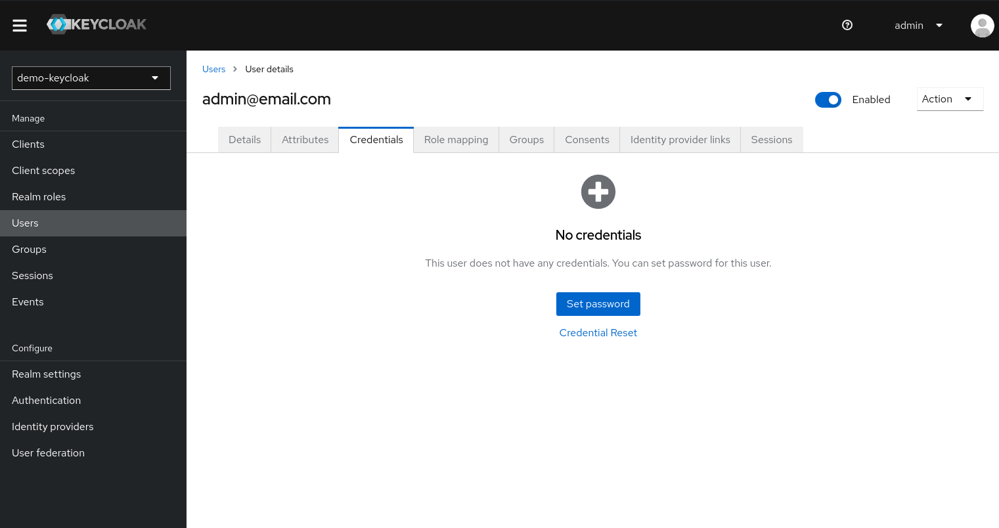

1. Enter at [keycloack admin console](http://localhost:8180/admin)

2. Login wiht credentials:

- username: admin
- password: admin

3. Select the `demo-keycloak` realm
   

4. Enter `Users` tab and click on `Add user`

5. Insert user info:

> You may create how many users you wish, but I recommend 2, one user and one admin, this will help to teste the RBAC latter on.

6. Next click on the user and enter `Role mapping` tab and clock `Assign role`:
   

7. At the popup assign `ADMIN` or `USER`:
   

8. And to finish, enter `Credential` tab and clock `Set password`:
   

9 Set a password:

