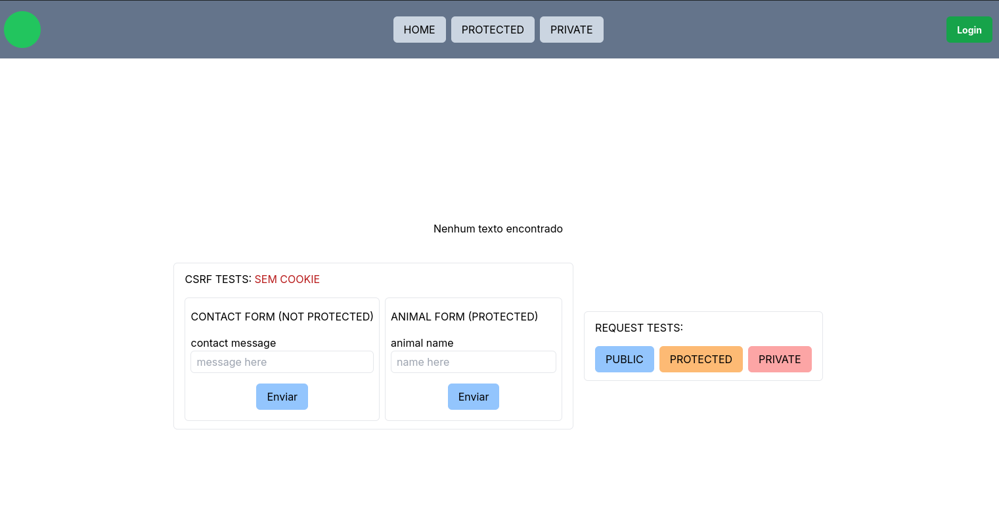

# NextJs + Spring Boot + Keycloak

This project is more of a demo or a base project to implement a fullstack application with OICD authentication and some of the market best pratices.

## Features/ lessons learnd

- Authentication using OAUTH2 standards mainly PKCE flow
- Usage of a keycloak server along with its configuration
- Server-side RBAC (Role Based Access Control)
- Client-side RBAC
- CSRF protection
- Request handlind for this specifc scenario

## How to run the project?

#### 1. Dependencies/ requirements

- Docker
- Free ports
  - 8080
  - 8180
  - 3000

#### 2. Running

##### 2.1. At the root folder run `docker compose up --build -d`. This should run and configure all the containers.

##### 2.2. [Config keycloak](./docs/keycloak-config.md)

##### 2.3 Access the [front-end application](http://localhost:3000)

#### 3. The app

At the app you may find a CSRF test, a request test and the frontend RBAC.

Te CSRF tests are:

- The (not protected) form should be able to send requests to the backend even without any XRSF cookies

- The (protected) form should only give a valid response when there are XSRF cookies set. The cookies are automatically set on every request to the resource server.

The request tests are:

> You are able to login or logout at the top right button

- Any user, even if not logged in may send requests to the public routes

- Only a logged user may send requests to a protected route

- Only a logged user that has the ADMIN role, may send requests to the private route

The front-end RBAC are:

- Any user, even if not logged in may see the Home page

- Only a logged user may see the protected page

- Only a logged user that has the ADMIN role, may see the private page
